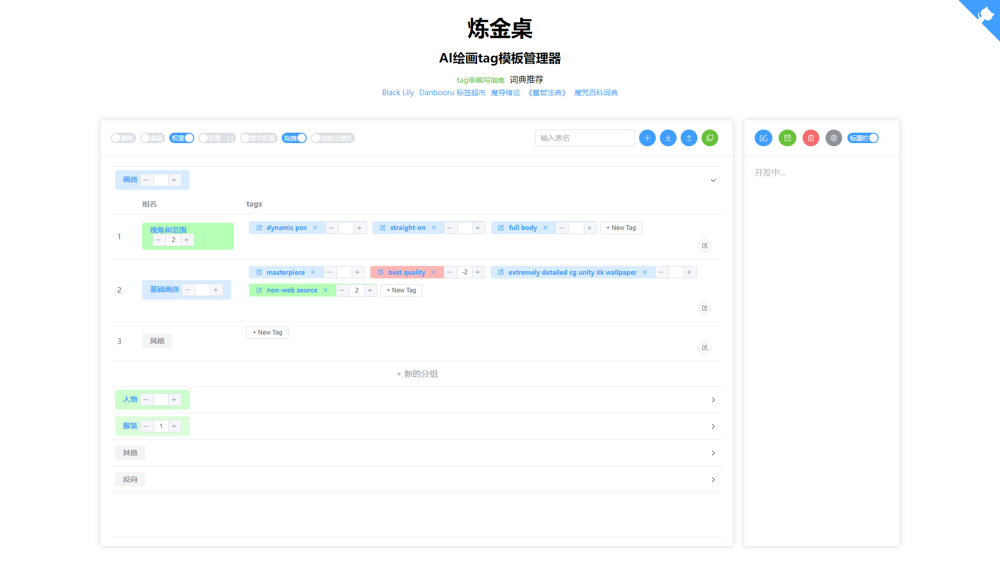

# AI绘画 tag 管理器
### Vue3 + Element Plus + pinia

[点击使用](https://izumkineno.github.io/ai-tag-model-manage/dist/)

[油猴注入版](https://greasyfork.org/zh-CN/scripts/458675-ai-tag-%E7%BB%98%E7%94%BB%E7%AE%A1%E7%90%86%E5%99%A8-stable-diffusion-%E6%B3%A8%E5%85%A5%E7%89%88)

#### 目前已有功能

- [x] 增删改

- [x] 大分组，小分组

- [x] 启用或关闭tag和组

- [x] 增加tag时识别`,`批量添加

- [x] tag和组拖拽移动

- [x] () ， []，{} 权重以及数字权重

- [x] 单个小分组输出长语句

- [x] 整个组编辑

- [x] 导入和导出当前内容

- [ ] 保存、加载和删除模板

- [ ] 设置

- [ ] ？tag翻译

- [ ] ？tag输入提示
